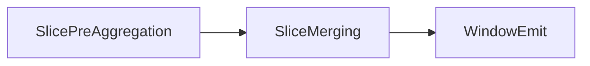
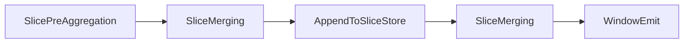

### Architecture of Slicing-based Window Operator

NebulaStream uses a slicing-based window operator to provide efficient support for time-based tumbling and sliding windows.
To this end we segmentate a stream into a list of *non-overlapping* slices.  
Each slices covers a subset of records and may contribute in multiple windows.

For example a sliding window with size = 10 and slide = 2 results of 5 slices.
[0-2, 2-4, 4-6, 6-8, 8-10].

To perform window aggregations, slices contain a pre-aggregate that is ether a value (or multiple in case of multiple aggregation functions) or a hash-map.
To this end, we differentiate between keyed and non-keyed slices.

To implement slicing for tumbling and sliding window aggregations we introduce the following fore operators.

- **SlicePreAggregation:**  
  The window pre-aggregation operator, receives individual records and derives their timestamp (r_ts), ether event or ingestion time.
  Based on the *r_ts* it finds or creates a slices in the thread local slice store. The thread local slice store maintains a list of all currently in-flight slices for each thread.
  Whenever the *watermark_ts* passes a slice end, the operator creates a *SliceMergeTask* and emits all thread local slices to the slice merging operator.
- **SliceMerging:**
  The slice merging operator receives a set of slices in a *SliceMergeTask* and merges them together.  
  For keyed slices this basically results in the merging of the different hash maps. If the same key exists in multiple slices the pre-aggregation value is combined.
- **AppendToSliceStore:**
  In case of a sliding window, this operator append the combined slice to a global slice store. This slice store maintains all slices that contribute to any inflight windows.
- **WindowEmit:** Finally, this operator emits a combined slice as a window. To this end, it finalizes the aggregation, e.g., it calculates the final value of an average aggregation.

#### Tumbling Windows:

In case of tumbling windows, we know that each slice only contributes to one window. 
Thus, we  directly emit the window result after we performed the slice merging.

#### Sliding Windows:

In the case of sliding windows, each slice is part of multiple windows.
Thus, we have to maintain it in a global data structure (in the AppendToSliceStore) till all windows that cover this slice are triggered.
If we can trigger a specific window, we select all slices and emit a *SliceMergeTask*. 
This is again processed by the *SliceMerging* operator, which in this case combines all slices for the window.
Finally, we emit the window with the WindowEmit operator.

Thus, this approaches allows us to reuse most operators independent for both window types.