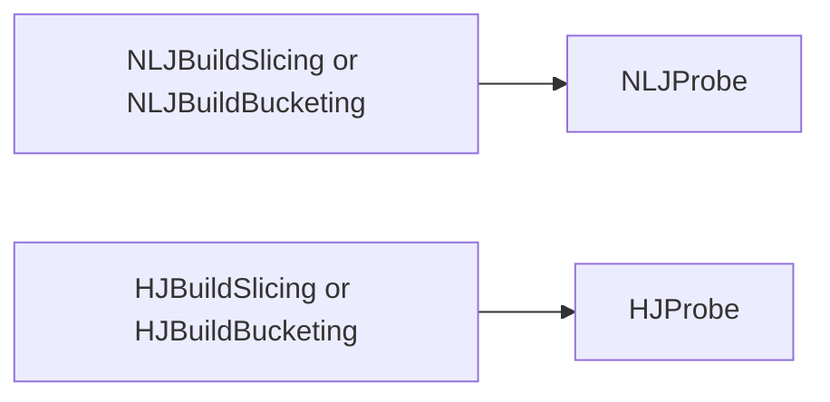

### Architecture of Stream Join

NebulaStream uses slicing and bucketing based approaches for providing efficient support for time-based tumbling and 
sliding windows. For the bucketing approach, each window is represented by its own bucket. Whereas we segment a stream
into a list of *non-overlapping* slices, for the slicing approach. Each slice covers a subset of records and may
contribute in multiple windows. For example a sliding window with size = 10 and slide = 2 results of 5 slices.
[0-2, 2-4, 4-6, 6-8, 8-10].

Both approaches are dissected into two phases, `build` and `probe`. During the `build` phase, the incoming records are
stored in the corresponding window(s) or slice until each window is ready to be triggered. What slices/windows to trigger
depends on the window strategy but independent of the join strategy. Triggering is also part of the operator handler,
which emits buffers to the `probe`. The `build` phase is different regarding the window strategy as well as join strategy. 

The difference between bucketing and slicing only happens during the `build` phase, e.g., `NLJBuildBucketing` vs. 
`NLJBuildSlicing`. As we merely have to duplicate the incoming tuple and store each 
record in multiple windows, for the bucketing strategy. Both `probe` phases (NLJ and HJ) are similar for bucketing or 
slicing, as we use the same classes/data structures and represent a window (in the bucketing scheme) as a single slice.

This implementation allows us to reuse parts of the join that are independent of either the window or join strategy.

#### Join Phases Flowchart

